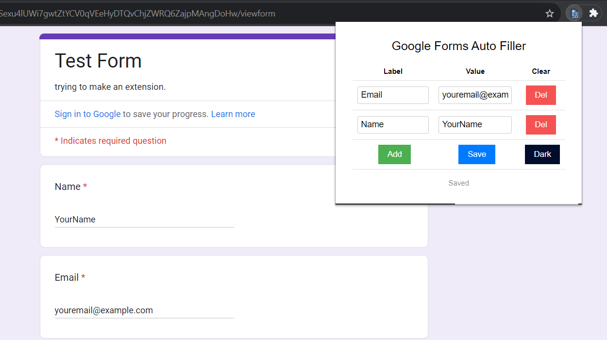
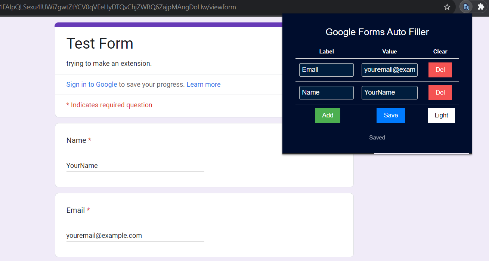

# Google Forms Auto Filler

### Light Mode Example

### Dark Mode Example

This add-on enters text into input fields of Google Forms by predefined values automatically. For example if you set *Name* as *Elon Musk*, each input fields of Google Forms whose title is *Name* gets *Elon Musk* value when the page is loaded.

IMPORTANT Note: Because of the Google Forms bot filling blocking, you must click and press space for each form field. (Thus Google will think you have filled out)

# Usage
1. Download the zip file of the repo, then unzip it.
2. Open the link - [chrome://extensions](chrome://extensions)
3. On the top right corner, enable the **Developer Mode**
4. Then, on the top left corner, click on the **Load Unpacked**
5. Select the folder of the extension - The directory inside the unzipped folder.

There you go. Now you can use the extension.