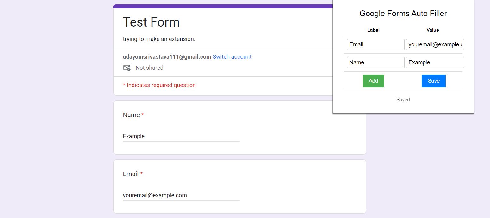

# Google Forms Auto Filler

This add-on enters text into input fields of Google Forms by predefined values automatically. For example if you set *Name* as *Elon Musk*, each input fields of Google Forms whose title is *Name* gets *Elon Musk* value when the page is loaded.

IMPORTANT Note: Because of the Google Forms bot filling blocking, you must click and press space for each form field. (Thus Google will think you have filled out)